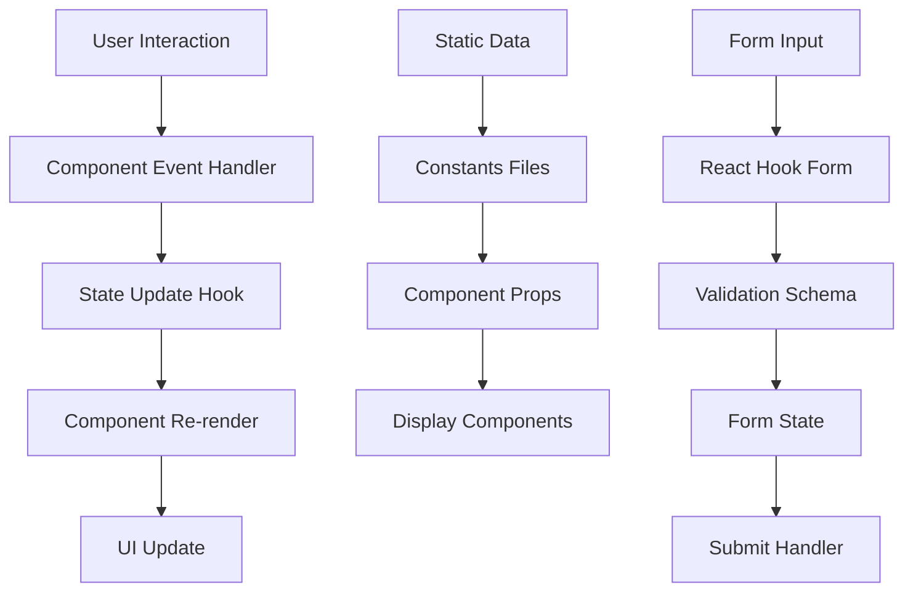

# Architecture Overview

## 🏗️ System Architecture

Hidden Lotus follows a modern, scalable architecture built on Next.js 15 with React 19, emphasizing performance, maintainability, and developer experience.

## 📁 Project Structure

```
src/
├── app/                    # Next.js App Router pages
│   ├── (routes)/          # Route groups
│   ├── globals.css        # Global styles
│   ├── layout.tsx         # Root layout
│   └── page.tsx           # Home page
├── components/            # Reusable UI components
│   ├── common/           # Shared components
│   ├── layout/           # Layout components
│   └── [feature]/        # Feature-specific components
├── constants/            # Static data and configuration
├── hooks/               # Custom React hooks
├── lib/                 # Utility functions and providers
├── styles/              # CSS modules and stylesheets
└── types/               # TypeScript type definitions
```

## 🎯 Design Patterns

### 1. Component Composition

- **Atomic Design**: Components are built in a hierarchy from atoms to organisms
- **Compound Components**: Complex UI elements are composed of smaller, focused components
- **Render Props**: Flexible component APIs using render functions

### 2. State Management

- **Local State**: React hooks for component-level state
- **Context API**: Global state for theme, loading states, and user preferences
- **Form State**: React Hook Form for complex form management
- **Server State**: Static data with potential for future API integration

### 3. Data Flow

- **Unidirectional**: Data flows down through props, events flow up through callbacks
- **Static Data**: Currently uses constants files for data (ready for API integration)
- **Type Safety**: All data structures are strongly typed with TypeScript

## 🔧 Technology Stack

### Core Framework

- **Next.js 15**: React framework with App Router
- **React 19**: Latest React with concurrent features
- **TypeScript 5**: Type safety and developer experience

### UI & Styling

- **PrimeReact**: Component library for consistent UI
- **Tailwind CSS**: Utility-first CSS framework
- **CSS Modules**: Scoped styling for components
- **Custom CSS**: Brand-specific styling and animations

### Form Management

- **React Hook Form**: Performant form handling
- **Zod**: Schema validation
- **@hookform/resolvers**: Form validation integration

### Development Tools

- **ESLint**: Code linting and formatting
- **PostCSS**: CSS processing
- **Autoprefixer**: CSS vendor prefixing

## 🏛️ Architectural Principles

### 1. Separation of Concerns

- **Presentation**: Components focus solely on rendering
- **Logic**: Custom hooks handle business logic
- **Data**: Constants and future API layer handle data
- **Styling**: Dedicated styling system with clear hierarchy

### 2. Reusability

- **Generic Components**: DisplayCard, FormField, etc.
- **Composable Patterns**: Components can be combined in various ways
- **Consistent APIs**: Similar components follow similar patterns

### 3. Performance

- **Code Splitting**: Automatic with Next.js App Router
- **Memoization**: Strategic use of React.memo and useMemo
- **Lazy Loading**: Images and components loaded on demand
- **Optimized Bundles**: Tree shaking and dead code elimination

### 4. Accessibility

- **Semantic HTML**: Proper HTML structure and landmarks
- **ARIA Attributes**: Screen reader support
- **Keyboard Navigation**: Full keyboard accessibility
- **Color Contrast**: WCAG compliant color schemes

## 🔄 Data Flow Architecture



## 🎨 Component Architecture

### Component Hierarchy

```
App Layout
├── Header
│   ├── Logo
│   ├── Navigation
│   └── Mobile Menu
├── Main Content
│   ├── Page Components
│   ├── Feature Components
│   └── Common Components
└── Footer
    ├── Links
    └── Social Media
```

### Component Categories

#### 1. Layout Components

- **Header**: Navigation and branding
- **Footer**: Links and information
- **Sidebar**: Mobile navigation
- **BackToTop**: Scroll-to-top functionality

#### 2. Common Components

- **DisplayCard**: Generic card component
- **FormField**: Reusable form input
- **FilterPanel**: Collapsible filter interface
- **HeroSection**: Page hero areas
- **LoadingSkeleton**: Loading states

#### 3. Feature Components

- **ClassesGrid**: Class listing and filtering
- **TeamCard**: Team member display
- **StoryCard**: Story/article display
- **MembershipTabs**: Membership information

## 🔐 Security Considerations

### Current Implementation

- **Static Data**: No dynamic data injection vulnerabilities
- **Type Safety**: TypeScript prevents many runtime errors
- **Input Validation**: Form validation with Zod schemas

### Future Considerations

- **API Security**: When adding backend integration
- **Authentication**: User session management
- **Data Sanitization**: Input sanitization for user-generated content
- **CSP Headers**: Content Security Policy implementation

## 📈 Performance Strategy

### Current Optimizations

- **Image Optimization**: Next.js Image component with lazy loading
- **Code Splitting**: Automatic route-based splitting
- **Memoization**: Strategic use of React.memo
- **Bundle Analysis**: Regular bundle size monitoring

### Future Optimizations

- **Service Workers**: Offline functionality
- **CDN Integration**: Static asset delivery
- **Database Caching**: API response caching
- **Progressive Web App**: Enhanced mobile experience

## 🧪 Testing Strategy

### Current State

- **Type Safety**: TypeScript provides compile-time error checking
- **Component Testing**: Ready for React Testing Library integration
- **E2E Testing**: Ready for Playwright or Cypress integration

### Recommended Testing

- **Unit Tests**: Component and hook testing
- **Integration Tests**: Feature workflow testing
- **Visual Regression**: UI consistency testing
- **Performance Tests**: Bundle size and runtime performance

## 🚀 Deployment Architecture

### Current Setup

- **Static Generation**: Next.js static export
- **Netlify Hosting**: CDN and edge functions
- **Environment Variables**: Configuration management

### Scalability Considerations

- **API Integration**: Backend service integration
- **Database**: Data persistence layer
- **Caching**: Redis or similar caching layer
- **Monitoring**: Application performance monitoring

---

_This architecture provides a solid foundation for a scalable, maintainable wellness platform while remaining flexible for future enhancements._
