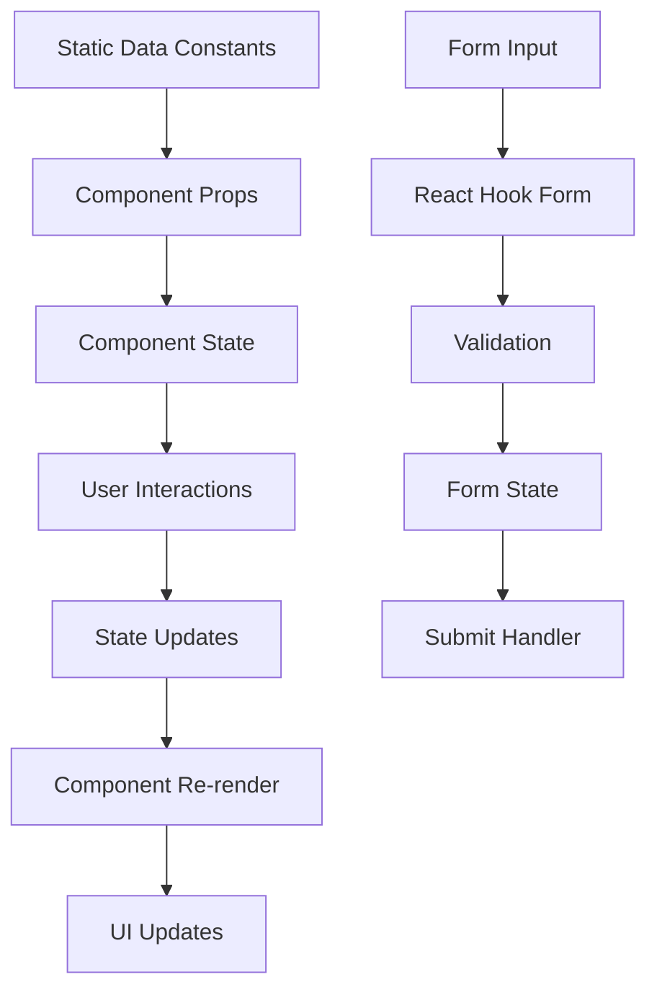

# Data Flow & State Management

## 🔄 Data Flow Architecture

Hidden Lotus uses a clean, unidirectional data flow pattern with React hooks for state management and static data constants for content. The architecture is designed to be easily extensible for future API integration.

## 📊 Current Data Architecture

### Data Sources
```typescript
// Static data constants
src/constants/
├── classes.ts      # Class data and types
├── team.ts         # Team member data
├── stories.ts      # Story/article data
├── mor.ts          # MOR section data
└── images.ts       # Image asset constants
```

### Data Flow Pattern


## 🏗️ State Management Patterns

### 1. Local Component State
```typescript
// useState for simple local state
const [sidebarVisible, setSidebarVisible] = useState(false)
const [imageLoaded, setImageLoaded] = useState(false)
const [imageError, setImageError] = useState(false)
```

### 2. Form State Management
```typescript
// React Hook Form for complex forms
const { control, watch, reset } = useForm<FilterForm>({
  defaultValues: {
    searchTerm: '',
    selectedCategory: '',
    selectedLevel: '',
    selectedInstructor: '',
  },
})

const filters = watch()
```

### 3. Computed State
```typescript
// useMemo for expensive computations
const filteredClasses = useMemo(() => {
  return classesData.filter((classItem: Class) => {
    // Filtering logic
    if (filters.searchTerm) {
      const searchLower = filters.searchTerm.toLowerCase()
      const matchesSearch = 
        classItem.name.toLowerCase().includes(searchLower) ||
        classItem.description?.toLowerCase().includes(searchLower)
      if (!matchesSearch) return false
    }
    // ... more filters
    return true
  })
}, [filters])
```

### 4. Context State (Future)
```typescript
// Ready for global state management
interface AppContextType {
  user: User | null
  theme: 'light' | 'dark'
  loading: boolean
  setUser: (user: User | null) => void
  setTheme: (theme: 'light' | 'dark') => void
  setLoading: (loading: boolean) => void
}

const AppContext = createContext<AppContextType | undefined>(undefined)
```

## 📋 Data Structures

### Core Data Types
```typescript
// Base entity pattern
interface BaseEntity {
  id: string
  name: string
  description?: string
  image?: string
}

// Class data structure
interface Class extends BaseEntity {
  instructor: string
  dates: string[]
  time: string
  duration: string
  price: string
  categories: ClassCategory[]
  level: ClassLevel
  maxParticipants: number
  equipment?: string[]
  longDescription: string
}

// Team member structure
interface TeamMember extends BaseEntity {
  profession: string
  credentials: string
  bio: string
  longBio: string
  type: TeamMemberType
  classes: string[]
  specialties: string[]
  certifications?: string[]
  experience: string
  education: string
  contact: BaseContact
}
```

### Filter State Management
```typescript
// Filter state interfaces
interface ClassFilterState {
  category: string
  level: string
  instructor: string
}

interface TeamFilterState {
  type: string
  profession: string
}

interface StoryFilterState {
  category: string
  author: string
}

// Generic filter state
interface FilterState {
  [key: string]: string | number | string[] | number[]
}
```

## 🔄 Data Flow Patterns

### 1. Props Down, Events Up
```typescript
// Parent component passes data down
<ClassesGrid
  classes={filteredClasses}
  onClearFilters={handleClearFilters}
/>

// Child component emits events up
const ClassesGrid = ({ classes, onClearFilters }: ClassesGridProps) => {
  return (
    <Button onClick={onClearFilters}>
      Clear All Filters
    </Button>
  )
}
```

### 2. Controlled Components
```typescript
// Form fields are controlled by React Hook Form
<FormField
  type="input"
  name="searchTerm"
  control={control}
  inputProps={{
    placeholder: 'Search classes...'
  }}
/>
```

### 3. Derived State
```typescript
// State derived from other state
const hasActiveFilters = Object.values(filters).some(Boolean)

// Computed values
const categories = [
  { label: 'All Categories', value: '' },
  ...Array.from(new Set(classesData.flatMap(c => c.categories)))
    .sort()
    .map(category => ({
      label: category.charAt(0).toUpperCase() + category.slice(1),
      value: category,
    }))
]
```

## 🎯 State Management Best Practices

### 1. State Colocation
```typescript
// Keep state close to where it's used
const DisplayCard = ({ data }: DisplayCardProps) => {
  const [imageLoaded, setImageLoaded] = useState(false)
  const [imageError, setImageError] = useState(false)
  
  // State is only used within this component
  return (
    <div>
      {!imageLoaded && !imageError && <LoadingSkeleton />}
      {imageError && <ErrorPlaceholder />}
      {!imageError && (
        <Image
          onLoad={() => setImageLoaded(true)}
          onError={() => setImageError(true)}
        />
      )}
    </div>
  )
}
```

### 2. State Lifting
```typescript
// Lift state up when multiple components need it
const ClassesPage = () => {
  const [filters, setFilters] = useState<ClassFilterState>({
    category: '',
    level: '',
    instructor: ''
  })
  
  return (
    <div>
      <FilterPanel filters={filters} onFilterChange={setFilters} />
      <ClassesGrid classes={filteredClasses} />
    </div>
  )
}
```

### 3. State Normalization
```typescript
// Normalize data for efficient lookups
const classesById = useMemo(() => {
  return classesData.reduce((acc, cls) => {
    acc[cls.id] = cls
    return acc
  }, {} as Record<string, Class>)
}, [classesData])

// Use normalized data
const getClassById = (id: string) => classesById[id]
```

## 🔧 Custom Hooks

### 1. Intersection Observer Hook
```typescript
// src/hooks/useIntersectionObserver.ts
export function useIntersectionObserver(options: UseIntersectionObserverOptions = {}) {
  const { threshold = 0.1, rootMargin = '0px', triggerOnce = true } = options
  const [isIntersecting, setIsIntersecting] = useState(false)
  const [hasTriggered, setHasTriggered] = useState(false)
  const ref = useRef<HTMLDivElement>(null)

  useEffect(() => {
    const element = ref.current
    if (!element) return

    const observer = new IntersectionObserver(
      ([entry]) => {
        if (entry.isIntersecting) {
          setIsIntersecting(true)
          if (triggerOnce) {
            setHasTriggered(true)
          }
        } else if (!triggerOnce) {
          setIsIntersecting(false)
        }
      },
      { threshold, rootMargin }
    )

    observer.observe(element)
    return () => observer.unobserve(element)
  }, [threshold, rootMargin, triggerOnce])

  return { ref, isIntersecting: triggerOnce ? hasTriggered : isIntersecting }
}
```

### 2. Media Query Hook
```typescript
// src/hooks/useMediaQuery.ts
export function useMediaQuery(query: string): boolean {
  const [matches, setMatches] = useState(false)

  useEffect(() => {
    const media = window.matchMedia(query)
    if (media.matches !== matches) {
      setMatches(media.matches)
    }
    
    const listener = () => setMatches(media.matches)
    media.addEventListener('change', listener)
    return () => media.removeEventListener('change', listener)
  }, [matches, query])

  return matches
}
```

## 📊 Data Transformation Patterns

### 1. Filtering and Searching
```typescript
// Generic filtering function
const filterItems = <T>(
  items: T[],
  filters: Record<string, any>,
  searchFields: (keyof T)[]
): T[] => {
  return items.filter(item => {
    // Search filter
    if (filters.searchTerm) {
      const searchLower = filters.searchTerm.toLowerCase()
      const matchesSearch = searchFields.some(field => {
        const value = item[field]
        return typeof value === 'string' && 
               value.toLowerCase().includes(searchLower)
      })
      if (!matchesSearch) return false
    }
    
    // Other filters
    return Object.entries(filters)
      .filter(([key]) => key !== 'searchTerm')
      .every(([key, value]) => {
        if (!value) return true
        return item[key as keyof T] === value
      })
  })
}
```

### 2. Data Aggregation
```typescript
// Aggregate data for dropdowns
const getUniqueValues = <T, K extends keyof T>(
  items: T[],
  field: K
): Array<{ label: string; value: T[K] }> => {
  return Array.from(new Set(items.map(item => item[field])))
    .sort()
    .map(value => ({
      label: String(value).charAt(0).toUpperCase() + String(value).slice(1),
      value
    }))
}
```

### 3. Data Validation
```typescript
// Zod schemas for data validation
const classSchema = z.object({
  id: z.string(),
  name: z.string().min(1),
  description: z.string().optional(),
  instructor: z.string().min(1),
  price: z.string().min(1),
  level: z.enum(['beginner', 'intermediate', 'advanced']),
  categories: z.array(z.string()),
  maxParticipants: z.number().positive(),
})

// Validate data
const validateClass = (data: unknown): Class => {
  return classSchema.parse(data)
}
```

## 🚀 Performance Optimizations

### 1. Memoization
```typescript
// Memoize expensive computations
const filteredClasses = useMemo(() => {
  return filterItems(classesData, filters, ['name', 'description', 'instructor'])
}, [filters])

// Memoize component rendering
const ClassesGrid = memo(function ClassesGrid({ classes, onClearFilters }) {
  const cardElements = useMemo(() => {
    return classes.map((cls, index) => (
      <DisplayCard key={cls.id} data={cls} />
    ))
  }, [classes])
  
  return <CardGrid>{cardElements}</CardGrid>
})
```

### 2. Lazy Loading
```typescript
// Lazy load components
const LazyMembershipPage = lazy(() => import('@/app/membership/page'))

// Lazy load images
<Image
  src={imageSrc}
  alt={alt}
  loading="lazy"
  placeholder="blur"
  blurDataURL="data:image/jpeg;base64,..."
/>
```

### 3. Virtual Scrolling (Future)
```typescript
// For large lists
const VirtualizedList = ({ items, renderItem }) => {
  const [visibleItems, setVisibleItems] = useState([])
  
  // Implementation for virtual scrolling
  return (
    <div>
      {visibleItems.map(renderItem)}
    </div>
  )
}
```

## 🔮 Future API Integration

### 1. Data Fetching Hooks
```typescript
// Custom hook for data fetching
function useClasses() {
  const [classes, setClasses] = useState<Class[]>([])
  const [loading, setLoading] = useState(true)
  const [error, setError] = useState<string | null>(null)

  useEffect(() => {
    const fetchClasses = async () => {
      try {
        setLoading(true)
        const response = await fetch('/api/classes')
        const data = await response.json()
        setClasses(data)
      } catch (err) {
        setError(err instanceof Error ? err.message : 'Unknown error')
      } finally {
        setLoading(false)
      }
    }

    fetchClasses()
  }, [])

  return { classes, loading, error }
}
```

### 2. State Management with SWR
```typescript
// SWR for server state
import useSWR from 'swr'

const fetcher = (url: string) => fetch(url).then(res => res.json())

function useClasses() {
  const { data, error, mutate } = useSWR('/api/classes', fetcher)
  
  return {
    classes: data,
    loading: !error && !data,
    error,
    mutate
  }
}
```

### 3. Optimistic Updates
```typescript
// Optimistic updates for better UX
const useOptimisticClasses = () => {
  const { classes, mutate } = useClasses()
  
  const addClass = async (newClass: Class) => {
    // Optimistic update
    mutate([...classes, newClass], false)
    
    try {
      await fetch('/api/classes', {
        method: 'POST',
        body: JSON.stringify(newClass)
      })
      // Revalidate
      mutate()
    } catch (error) {
      // Revert on error
      mutate()
      throw error
    }
  }
  
  return { classes, addClass }
}
```

## 🧪 Testing Data Flow

### 1. Unit Tests
```typescript
// Test data transformations
describe('filterItems', () => {
  it('should filter items by search term', () => {
    const items = [
      { name: 'Yoga Class', description: 'Morning flow' },
      { name: 'Meditation', description: 'Evening session' }
    ]
    
    const result = filterItems(items, { searchTerm: 'yoga' }, ['name', 'description'])
    expect(result).toHaveLength(1)
    expect(result[0].name).toBe('Yoga Class')
  })
})
```

### 2. Integration Tests
```typescript
// Test component interactions
describe('ClassesPage', () => {
  it('should filter classes when search term changes', () => {
    render(<ClassesPage />)
    
    const searchInput = screen.getByPlaceholderText('Search classes...')
    fireEvent.change(searchInput, { target: { value: 'yoga' } })
    
    expect(screen.getByText('Yoga Class')).toBeInTheDocument()
    expect(screen.queryByText('Meditation')).not.toBeInTheDocument()
  })
})
```

## 📋 Data Flow Checklist

### ✅ Current Implementation
- [x] Unidirectional data flow
- [x] Props down, events up
- [x] Local state management
- [x] Form state with React Hook Form
- [x] Computed state with useMemo
- [x] Custom hooks for reusable logic
- [x] Type-safe data structures
- [x] Performance optimizations

### 🔄 Future Enhancements
- [ ] Global state management (Context/Redux)
- [ ] API integration
- [ ] Caching strategies
- [ ] Offline support
- [ ] Real-time updates
- [ ] Data synchronization

---

*This data flow architecture provides a solid foundation for managing state and data in the Hidden Lotus application while remaining flexible for future enhancements and API integration.*
